<div dir="rtl">

<h1 align="center">برگ · رزومه‌ساز فارسی</h1>

<p align="center">
  رزومه‌ساز فارسی و راست‌به‌چپ که از اول تا آخر در مرورگر اجرا می‌شود؛
  بنویس، قالب و رنگش را انتخاب کن و PDF یا Word بگیر. بدون ثبت‌نام و بدون سرور.
</p>

<p align="center">
  
  
  
  
  
  
</p>

<p align="center">
  <a href="#gallery">نمایش تصویری</a> ·
  <a href="#templates">ده قالب</a> ·
  <a href="#features">امکانات</a> ·
  <a href="#start">شروع سریع</a> ·
  <a href="#architecture">ساختار پروژه</a> ·
  <a href="#notes">نکته‌های فنی</a>
</p>

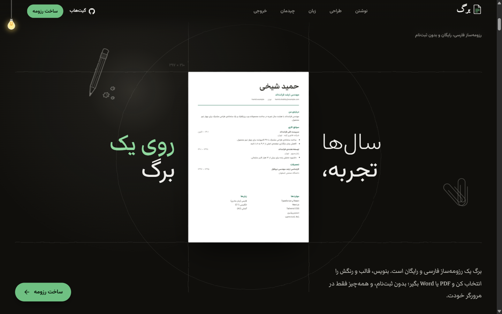

> همه‌ی تصویرهای این صفحه از اجرای واقعی برنامه گرفته شده‌اند. رزومه‌ی نمونه با نام سازنده‌ی برگ پر شده است؛ سوابق کاری و نام شرکت‌هایش ساختگی‌اند و فقط برای نمایش قالب‌ها آمده‌اند.

برگ یک برنامه‌ی ایستای React است. رزومه را در فرم می‌نویسی و همان لحظه روی برگه‌ی A4 می‌بینی؛ همه‌چیز خودکار در حافظه‌ی همان مرورگر ذخیره می‌شود و هیچ داده‌ای به سروری فرستاده نمی‌شود. برای استفاده از آن حساب کاربری، بک‌اند یا کلید API لازم نیست.

| بنویس                                                      | طراحی کن                                                    | بگیر                                                         |
| :--------------------------------------------------------- | :---------------------------------------------------------- | :----------------------------------------------------------- |
| ۲۲ بخش آماده و بخش دلخواه، پیش‌نمایش زنده، تاریخ شمسی | ۱۰ قالب رسمی، ۶ رنگ‌بندی برای هر قالب، ۴ قلم، رزومه‌ی انگلیسی | PDF با متن قابل انتخاب، PDF تصویری، Word و فایل پشتیبان JSON |

<a id="gallery"></a>

## نمایش تصویری

### صفحه‌ی معرفی: یک داستان اسکرولی

صفحه‌ی نخست یک داستان است که با اسکرول جلو می‌رود: تکه‌های یک کارنامه از گوشه‌های صفحه می‌آیند و برگه می‌شوند، برگه نوشته و بازنویسی می‌شود، قالب و زبانش عوض می‌شود، بخش‌هایش با نخ به فهرست وصل می‌شوند و در آخر در آسمان شب به فایل تبدیل می‌شود. پیش‌فرض صفحه تیره است و نوری گرم دنبال نشانگر موس می‌آید؛ با کشیدن بند لامپ بالای صفحه، صفحه روشن می‌شود. سرصفحه هم به هر بخش داستان می‌پرد.

|                                                                          سرآغاز                                                                          |                                                                       ۰۱ · نوشتن                                                                       |
| :-----------------------------------------------------------------------------------------------------------------------------------------------------: | :---------------------------------------------------------------------------------------------------------------------------------------------------: |
| [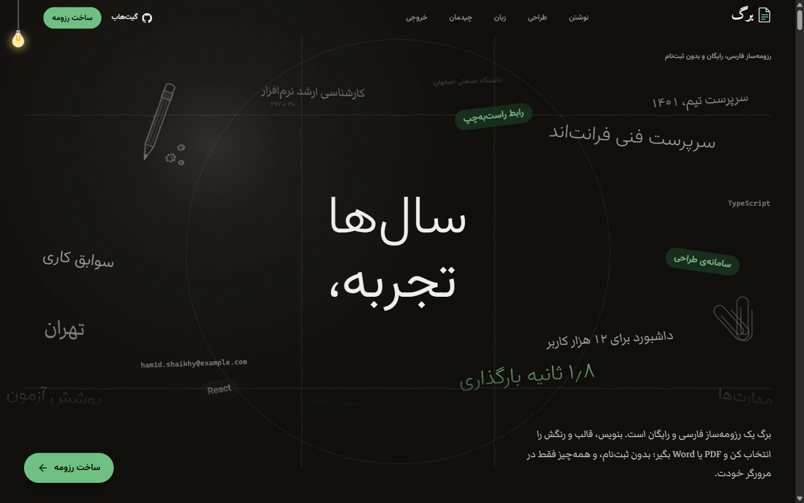](docs/screenshots/intro-hero-start.png) | [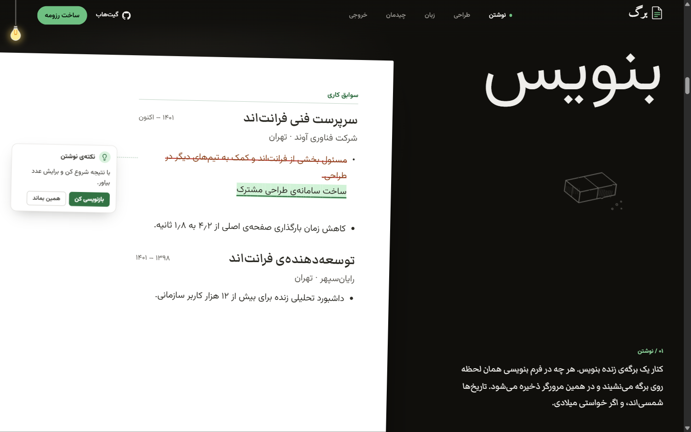](docs/screenshots/intro-write.png) |
|                                  تکه‌های یک کارنامه با موس جابه‌جا می‌شوند و با اسکرول روی هم می‌نشینند و برگه می‌شوند.                                   |                                     یک خط تایپ می‌شود، خط می‌خورد و جمله‌ی بهتر جایش تایپ و در مرورگر ذخیره می‌شود.                                     |

|                                                                      ۰۲ · طراحی                                                                      |                                                                    ده قالب، شش رنگ                                                                     |
| :-------------------------------------------------------------------------------------------------------------------------------------------------: | :---------------------------------------------------------------------------------------------------------------------------------------------------: |
| [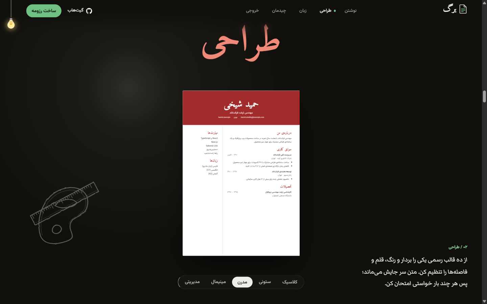](docs/screenshots/intro-design.png) | [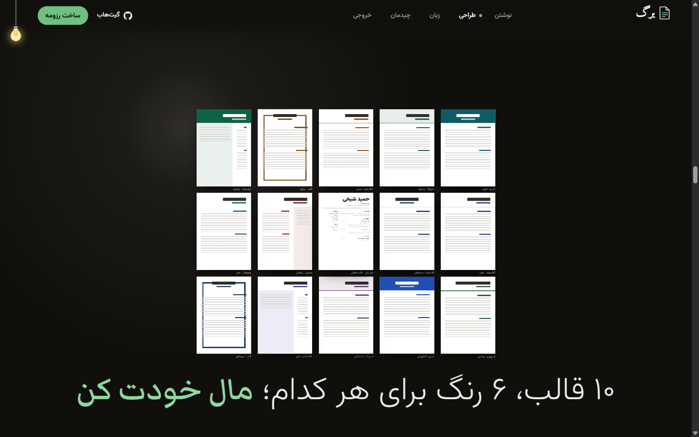](docs/screenshots/intro-templates.png) |
|                                          پنج قالب روی برگه کشیده می‌شوند و قلم تیتر با هر قالب عوض می‌شود.                                           |                                          صحنه دور می‌شود تا برگه‌های کوچک قالب‌ها و رنگ‌بندی‌ها پیدا شوند.                                           |

|                                                                        ۰۳ · زبان                                                                        |                                                                       ۰۴ · چیدمان                                                                        |
| :---------------------------------------------------------------------------------------------------------------------------------------------------: | :-----------------------------------------------------------------------------------------------------------------------------------------------------: |
| [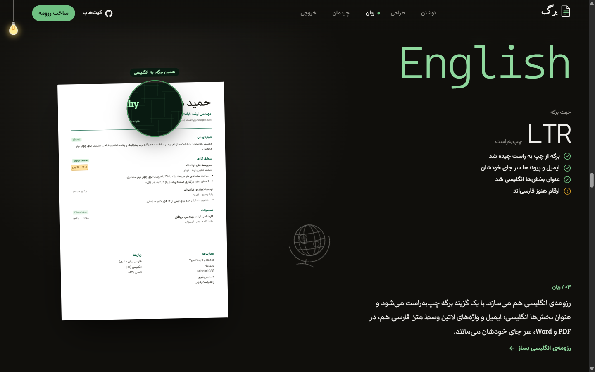](docs/screenshots/intro-language.png) | [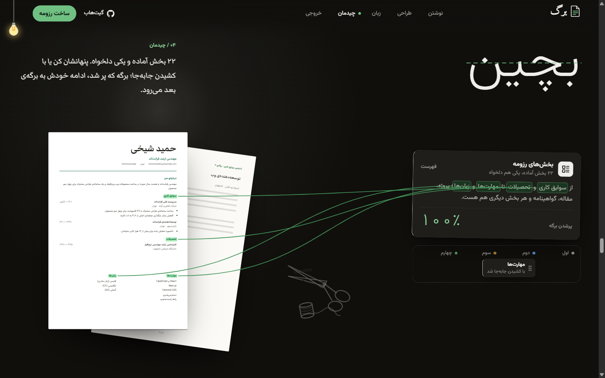](docs/screenshots/intro-arrange.png) |
|                          خط جاروب «فارسی» را به «English» برمی‌گرداند و ذره‌بینی که با موس هم جابه‌جا می‌شود برگه‌ی انگلیسی را نشان می‌دهد.                          |                                   از هر بخش فهرست نخی تا تیترش کشیده می‌شود، برگه پر می‌شود و برگه‌ی دوم بیرون می‌آید.                                   |

|                                                                     ۰۵ · خروجی                                                                     |                                                                         همیشه رایگان                                                                          |
| :-----------------------------------------------------------------------------------------------------------------------------------------------: | :-------------------------------------------------------------------------------------------------------------------------------------------------------: |
| [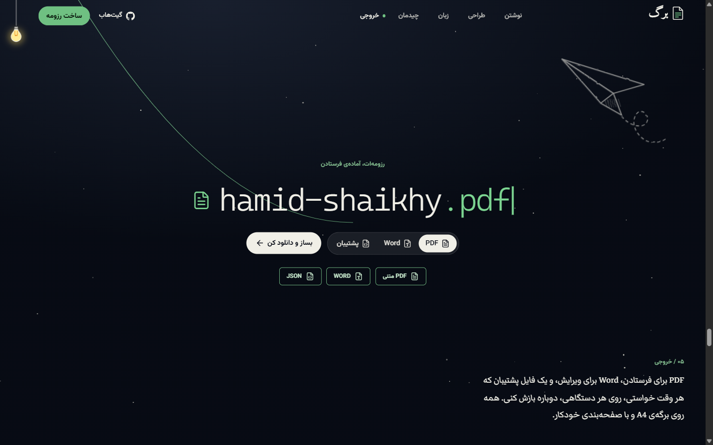](docs/screenshots/intro-export.png) | [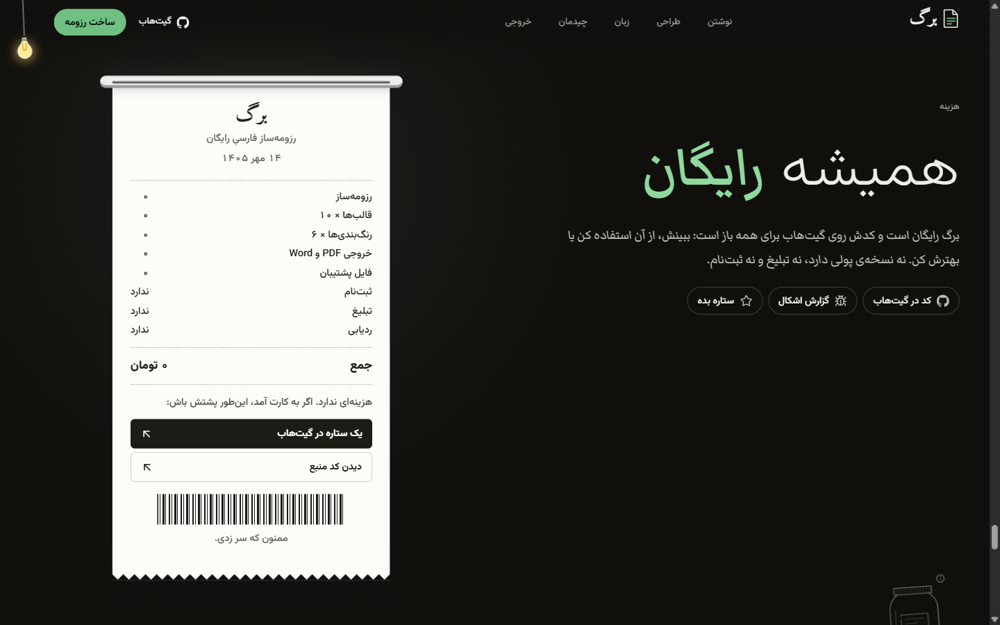](docs/screenshots/intro-free.png) |
|                            برگه روی یک رد سبز پرواز می‌کند و نام فایل با پسوند PDF، Word یا پشتیبان تایپ می‌شود.                            |                                         رسیدی که از دستگاه بیرون می‌آید: همه‌چیز صفر، بدون تبلیغ و ثبت‌نام.                                          |

|                                                                     پرسش‌ها                                                                     |                                                                       پایان                                                                       |
| :--------------------------------------------------------------------------------------------------------------------------------------------: | :---------------------------------------------------------------------------------------------------------------------------------------------: |
| [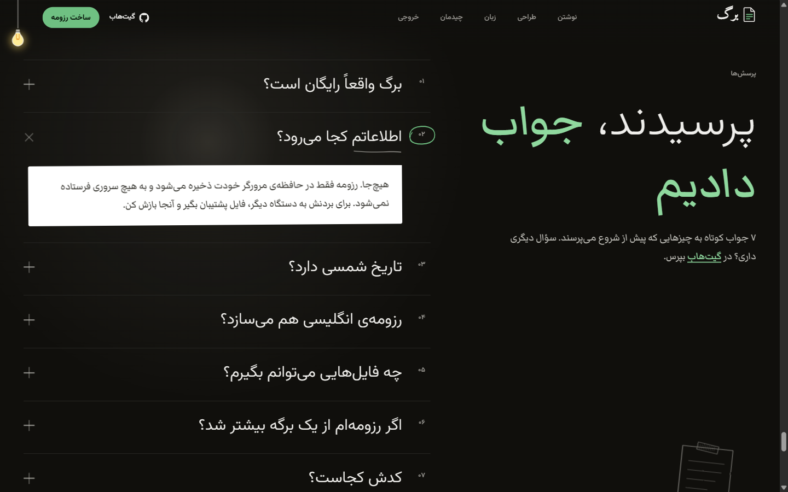](docs/screenshots/intro-faq.png) | [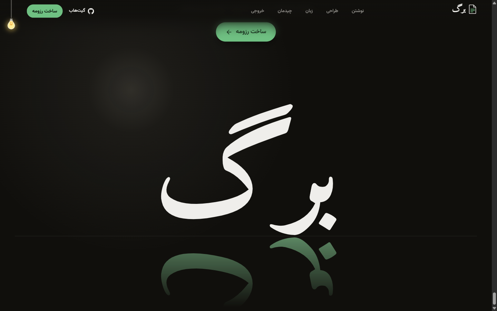](docs/screenshots/intro-end.png) |
|                                     بازشدن هر پرسش دور شماره‌اش دایره‌ی مدادی می‌کشد و پاسخ را مثل یادداشت باز می‌کند.                                     |                                         واژه‌ی «برگ» از خط افق بالا می‌آید و بازتابش، سبز و محو، پایین می‌رود.                                          |

|                                                                  حالت روشن                                                                   |                                                                     حالت روشن، نوشتن                                                                     |
| :-----------------------------------------------------------------------------------------------------------------------------------------: | :-----------------------------------------------------------------------------------------------------------------------------------------------------: |
| [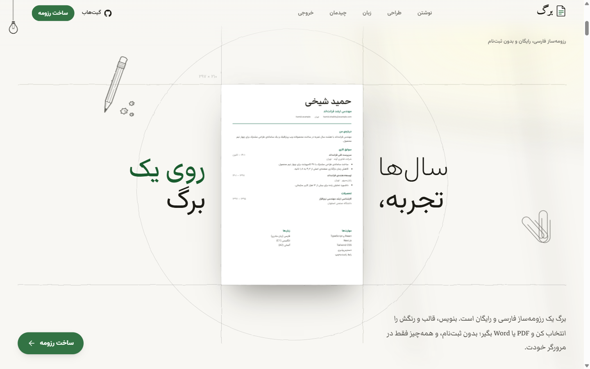](docs/screenshots/intro-light.png) | [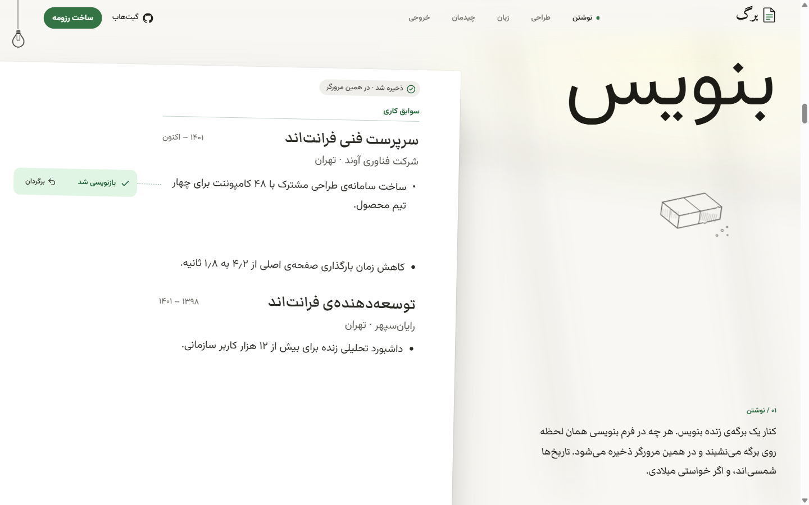](docs/screenshots/intro-light-write.png) |
|                                      با کشیدن بند لامپ، صفحه روشن می‌شود و نور پنجره و غبار جای نور موس را می‌گیرند.                                      |                                                       انتخاب حالت در همان مرورگر به خاطر می‌ماند.                                                        |

### رزومه‌ساز

فرم در یک طرف و برگه‌ی زنده در طرف دیگر. هر تغییر همان لحظه روی برگه دیده می‌شود و خودکار در `localStorage` ذخیره می‌شود.

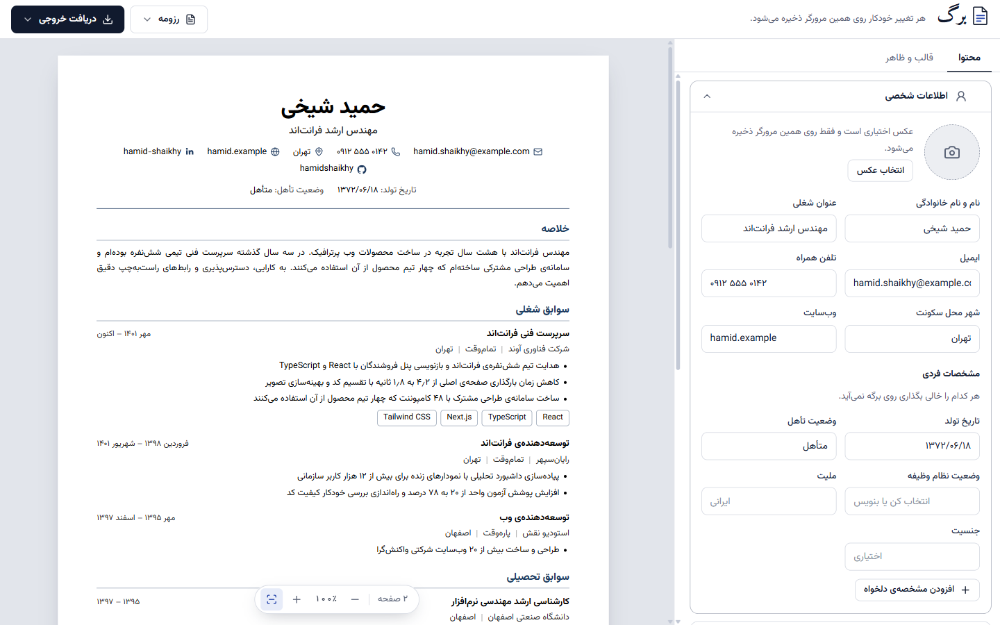

|                                                                     قالب و ظاهر                                                                     |                                                                       خروجی‌ها                                                                       |
| :-----------------------------------------------------------------------------------------------------------------------------------------------: | :-------------------------------------------------------------------------------------------------------------------------------------------------: |
| [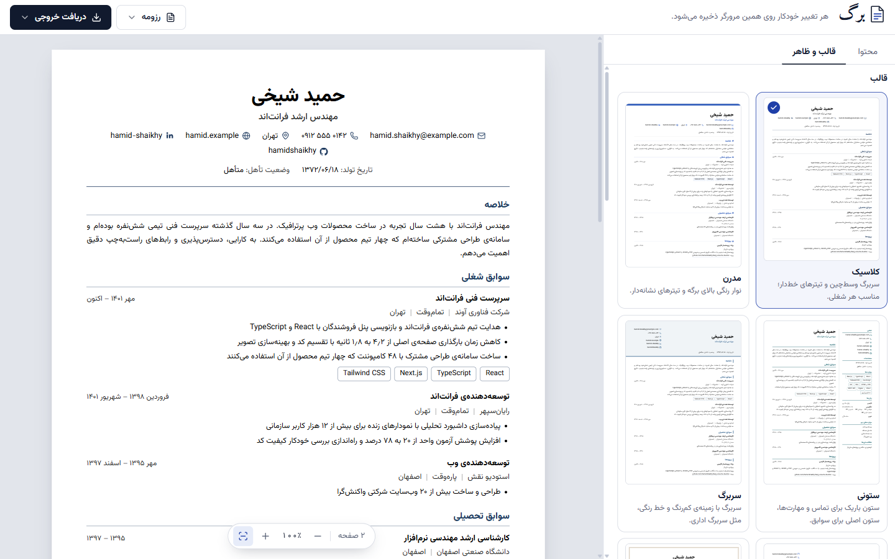](docs/screenshots/builder-design.png) | [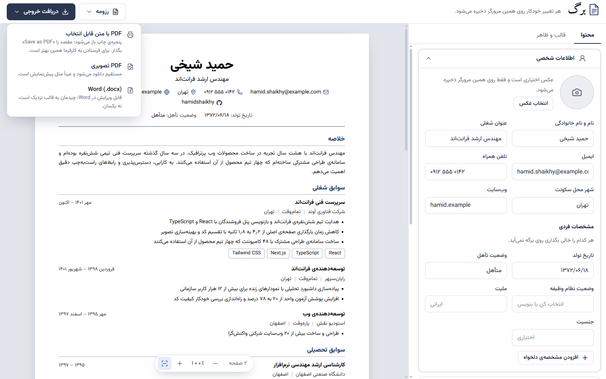](docs/screenshots/builder-export.png) |
|                                قالب، رنگ‌بندی، قلم، اندازه و فاصله‌ها، زبان، تقویم، ارقام و عکس از همین پنل عوض می‌شوند.                                 |                                    PDF متنی از راه چاپ، PDF تصویری با دانلود مستقیم، Word قابل ویرایش و فایل پشتیبان.                                    |

### موبایل

|                                                                      معرفی                                                                       |                                                                     چیدمان                                                                      |                                                                      ویرایش                                                                       |                                                                     پیش‌نمایش                                                                     |
| :----------------------------------------------------------------------------------------------------------------------------------------------: | :---------------------------------------------------------------------------------------------------------------------------------------------: | :----------------------------------------------------------------------------------------------------------------------------------------------: | :----------------------------------------------------------------------------------------------------------------------------------------------: |
| [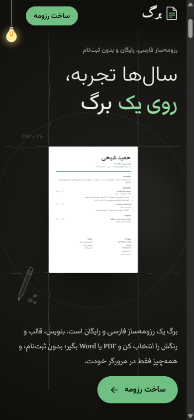](docs/screenshots/mobile-intro.png) | [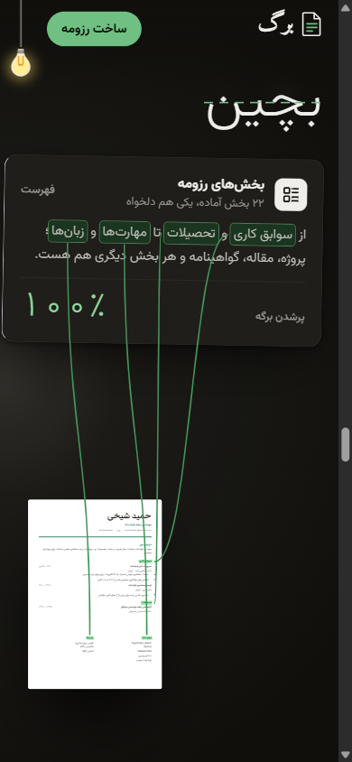](docs/screenshots/mobile-arrange.png) | [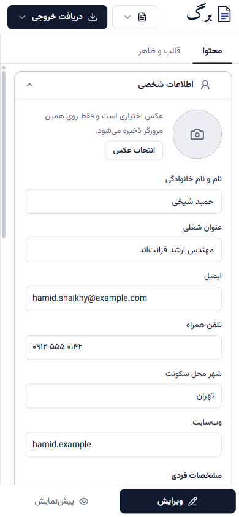](docs/screenshots/mobile-builder.png) | [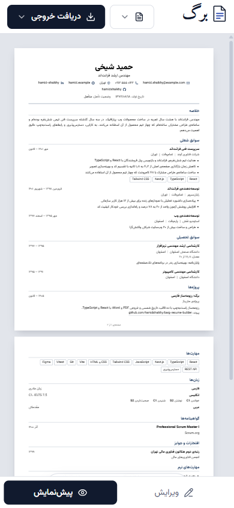](docs/screenshots/mobile-preview.png) |

<a id="templates"></a>

## ده قالب

[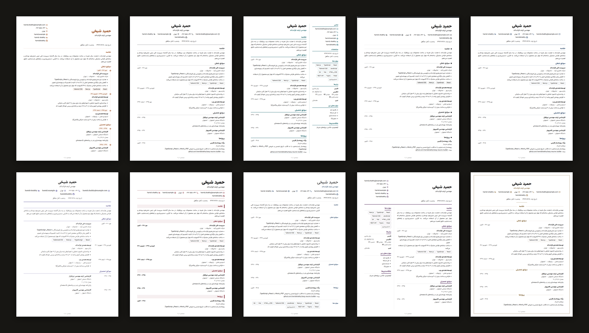](docs/screenshots/templates-gallery.png)

به ترتیب از راست، ردیف بالا و بعد ردیف پایین:

| قالب    | ویژگی                                                   |
| :------ | :------------------------------------------------------ |
| کلاسیک  | سربرگ وسط‌چین و تیترهای خط‌دار؛ مناسب هر شغلی.          |
| مدرن    | نوار رنگی بالای برگه و تیترهای نشانه‌دار.               |
| ستونی   | ستون باریک برای تماس و مهارت‌ها، ستون اصلی برای سوابق.  |
| سربرگ   | سربرگ با زمینه‌ی کم‌رنگ و خط رنگی، مثل سربرگ اداری.     |
| خط زمان | سوابق روی یک خط زمانی با تاریخ بالای هر مورد.           |
| قاب     | قاب نازک دور برگه و تیترهای وسط‌چین؛ رسمی و اداری.      |
| دوستونه | سربرگ تمام‌عرض و دو ستون زیر آن؛ برای رزومه‌های پرمحتوا. |
| مینیمال | عنوان بخش‌ها در حاشیه و فضای خالی زیاد.                 |
| مدیریتی | نام درشت و تیترهای نواری؛ برای سمت‌های ارشد.            |
| آکادمیک | قلم نسخ، تاریخ‌ها در ستون جدا؛ برای رزومه‌ی دانشگاهی.    |

هر قالب شش رنگ‌بندی دارد. زمینه‌ی برگه همیشه سفید و متن سیاه می‌ماند؛ رنگ فقط روی تیترها و خط‌ها می‌نشیند.

<a id="features"></a>

## امکانات اصلی

- **۲۲ بخش آماده و هر تعداد بخش دلخواه:** اطلاعات شخصی (با تاریخ تولد، تأهل و نظام وظیفه)، شبکه‌ها، خلاصه، سوابق شغلی، تحصیلات، مهارت‌ها، پروژه‌ها، زبان‌ها (با چهار مهارت CEFR)، گواهینامه‌ها، دوره‌ها، مهارت‌های نرم، افتخارات، مقالات، سوابق پژوهشی، تدریس، سخنرانی‌ها، اختراعات، فعالیت داوطلبانه، عضویت‌ها، علاقه‌مندی‌ها، معرف‌ها و اطلاعات تکمیلی.
- **پیش‌نمایش زنده و ذخیره‌ی خودکار:** هر تغییر همان لحظه روی برگه دیده می‌شود و در `localStorage` همان مرورگر می‌ماند.
- **صفحه‌بندی خودکار روی A4:** محتوا بین برگه‌ها پخش می‌شود و تیتر هیچ بخشی از متنش جدا نمی‌افتد.
- **فارسیِ درست:** تاریخ شمسی یا میلادی، ارقام فارسی یا لاتین، و ایمیل و واژه‌های لاتین وسط متن فارسی سر جای خودشان؛ هم روی برگه، هم در PDF و Word.
- **رزومه‌ی انگلیسی:** با یک گزینه برگه چپ‌به‌راست می‌شود و عنوان بخش‌ها انگلیسی.
- **چیدمان با کشیدن:** جابه‌جایی بخش‌ها و موردها با موس، لمس و صفحه‌کلید؛ پنهان‌کردن هر بخشی که لازم نیست.
- **خروجی‌ها:** PDF با متن قابل انتخاب (از راه چاپ مرورگر)، PDF تصویری با دانلود مستقیم، Word (‎`.docx`‎) قابل ویرایش و فایل پشتیبان JSON که دوباره در برگ باز می‌شود.
- **چهار قلم برای برگه:** وزیرمتن، نوتو سنس، نوتو نسخ و مرکزی.
- **صفحه‌ی معرفی اسکرولی** با حالت تیره و روشن، نور دنبال موس، طرح‌های مدادی و حرکت‌هایی که همه با اسکرول جلو می‌روند؛ با «کاهش حرکت» در سیستم‌عامل، هر صحنه در حالت پایانی‌اش نشان داده می‌شود.

<a id="start"></a>

## شروع سریع

**پیش‌نیاز:** Node.js نسخه‌ی ۲۰ یا جدیدتر و npm.

```bash
git clone https://github.com/hamidshaikhy/barg-resume-builder.git
cd barg-resume-builder
npm install
npm run dev
```

برنامه را در **[http://localhost:5173](http://localhost:5173)** باز کن.

برای یک بازدید سریع:

1. صفحه‌ی معرفی را تا آخر اسکرول کن و بند لامپ بالای صفحه را بکش.
2. «ساخت رزومه» را بزن؛ رزومه‌ی نمونه باز می‌شود. متن‌ها را با حرف‌های خودت عوض کن.
3. از زبانه‌ی «قالب و ظاهر» قالب، رنگ و قلم را عوض کن.
4. از «دریافت خروجی» فایل PDF یا Word بگیر، یا یک فایل پشتیبان ذخیره کن.

### ساخت نسخه‌ی نهایی

```bash
npm run build      # بررسی نوع‌ها و ساخت نسخه‌ی نهایی در dist
npm run preview    # دیدن نسخه‌ی ساخته‌شده
```

خروجی در `dist/` قرار می‌گیرد و روی هر میزبان ایستایی کار می‌کند؛ مسیریابی هش‌محور است و تنظیم سرور لازم ندارد.

<a id="architecture"></a>

## ساختار پروژه

```text
src/
├─ resume/            موتور رزومه (مستقل از رابط ویرایشگر)
│  ├─ types.ts          مدل داده
│  ├─ sections.ts       تعریف نوع بخش‌ها و فیلدهایشان
│  ├─ templates.ts      ده قالب، پالت رنگ‌ها و قلم‌ها
│  ├─ document.tsx      تبدیل رزومه به «بلوک»های قابل صفحه‌بندی
│  ├─ ResumePages.tsx   اندازه‌گیری بلوک‌ها و چیدن روی برگه‌های A4
│  ├─ resume.css        سبک قالب‌ها و قواعد چاپ
│  ├─ i18n.ts           برچسب‌های روی برگه و نام ماه‌ها
│  └─ sample.ts         رزومه‌ی نمونه
├─ export/            خروجی PDF، Word و JSON
├─ store/             وضعیت برنامه و اعتبارسنجی داده‌ی ورودی
├─ pages/
│  ├─ intro/            صفحه‌ی معرفی
│  │  ├─ scroll.ts        موتور اسکرول و وضعیت صحنه‌ها
│  │  ├─ landing.css      رنگ‌ها و همه‌ی حرکت‌های صفحه
│  │  ├─ hero.tsx …       یک فایل برای هر صحنه
│  │  ├─ sheet.tsx        برگه‌ی نمونه در پنج ظاهر
│  │  └─ doodles.tsx      طرح‌های مدادی SVG
│  └─ builder/          ویرایشگر، پنل ظاهر، پیش‌نمایش و منوی خروجی
└─ components/        اجزای مشترک رابط
docs/screenshots/     تصویرهای این صفحه
```

| بخش              | ابزار                                                           |
| :--------------- | :-------------------------------------------------------------- |
| رابط کاربری      | React 19، TypeScript، Vite                                      |
| سبک‌دهی          | Tailwind CSS 4 برای رابط؛ CSS ساده با واحد میلی‌متر برای برگه‌ها |
| وضعیت            | Zustand با `persist`                                            |
| پویانمایی معرفی  | موتور اسکرول خودساخته با متغیرهای CSS؛ بدون کتابخانه‌ی پویانمایی |
| مرتب‌سازی        | dnd-kit                                                         |
| خروجی Word       | docx                                                            |
| خروجی PDF تصویری | html2canvas-pro و jsPDF                                         |
| مسیریابی         | React Router (هش‌محور، مناسب میزبان ایستا)                     |

<a id="notes"></a>

## نکته‌های فنی

**صفحه‌ی معرفی.** موتور اسکرول در هر فریم فقط یک عدد برای هر بخش می‌نویسد: پیشرفت آن بخش از ۰ تا ۱ در متغیر CSS به نام `--p`. همه‌ی حرکت‌ها (کشیده‌شدن قالب‌ها، تایپ حرف‌ها، نخ‌ها، پرواز برگه) با `calc()` از همین عدد ساخته می‌شوند، پس React فقط در گام‌های درشت دوباره رندر می‌شود. متن تایپی فارسی حرف به حرف ظاهر می‌شود و مرورگر حرف‌ها را از روی مرز عنصرها هم به هم می‌چسباند.

**صفحه‌بندی.** رزومه به بلوک‌های کوچک شکسته می‌شود (تیتر بخش، سرِ هر مورد، هر خط توضیح). یک نسخه‌ی پنهان از کل محتوا بیرون از صفحه رسم می‌شود تا ارتفاع بلوک‌ها بدون اثر `transform` اندازه‌گیری شود؛ بعد بلوک‌ها به ترتیب روی برگه‌های ۲۱۰ × ۲۹۷ میلی‌متری چیده می‌شوند. بلوک‌هایی مثل تیتر، علامت «با بعدی بمان» دارند. در قالب‌های دوستونه هر ستون جدا صفحه‌بندی می‌شود.

**قالب‌ها.** هر ده قالب از یک ساختار HTML استفاده می‌کنند و تفاوتشان در CSS و چند تنظیم (چیدمان، نوع سربرگ، شکل موردها) است. رنگ هر قالب با چهار متغیر CSS کنترل می‌شود.

**PDF.** گزینه‌ی اول از چاپ مرورگر استفاده می‌کند (‎`@page` با اندازه‌ی A4 و حاشیه‌ی صفر) و متن واقعی می‌دهد. گزینه‌ی دوم هر برگه را عکس می‌کند؛ ظاهرش عیناً همان پیش‌نمایش است ولی متنش قابل انتخاب نیست.

**Word.** چیدمان هر قالب با پاراگراف و جدول بی‌خط بازسازی می‌شود. تکه‌های لاتینِ داخل متن فارسی در runهای جدا نوشته می‌شوند تا ترتیبشان به‌هم نریزد. قلم وزیرمتن داخل فایل جاسازی می‌شود؛ سه قلم دیگر فقط به نام ذکر می‌شوند و اگر روی سیستم نصب نباشند Word قلم جایگزین می‌گذارد. خروجی Word به قالب نزدیک است، نه یکسان با آن.

### مرزها و محدودیت‌ها

- داده‌ها فقط در `localStorage` همان مرورگر است و همگام‌سازی ابری ندارد؛ برای جابه‌جایی بین دستگاه‌ها فایل پشتیبان بگیر.
- در هر مرورگر یک رزومه نگه داشته می‌شود.
- موردی که از یک برگه‌ی کامل بلندتر باشد شکسته نمی‌شود.
- با تغییر تقویم، نام ماه‌ها عوض می‌شود ولی سال‌های نوشته‌شده خودکار تبدیل نمی‌شوند.

## قلم‌ها و اعتبارها

- وزیرمتن، نوتو سنس عربی، نوتو نسخ عربی، مرکزی و امیری همگی با مجوز SIL Open Font License منتشر شده‌اند و از بسته‌های npm بارگذاری می‌شوند.
- ایده‌ی حرکت‌های صفحه‌ی معرفی از صفحه‌ی نخست [Reactive Resume](https://github.com/reactive-resume/reactive-resume) گرفته شده و برای فارسی و راست‌به‌چپ از نو نوشته شده است. آن پروژه با مجوز MIT منتشر شده است: Copyright (c) 2026 Amruth Pillai.
- طرح‌های مدادی و برگه‌های نمونه‌ی صفحه‌ی معرفی مخصوص همین پروژه کشیده شده‌اند.

**مجوز کد اصلی هنوز انتخاب نشده است** و فایل LICENSE در این ریپازیتوری وجود ندارد.

---

<p align="center">
  طراحی و توسعه: <a href="https://github.com/hamidshaikhy">حمید شیخی</a>
</p>

</div>

---

## English

**Barg** is a Persian, right-to-left résumé builder that runs entirely in the browser.

- Scroll-driven landing page with a dark/light theme switch (a pull-cord lamp), a cursor-following light and six pinned scenes, driven by a small CSS-variable scroll engine
- Live editor with 22 ready sections plus unlimited custom ones
- 10 formal templates with 6 colour schemes each; the sheet stays white and the text black
- Automatic A4 pagination
- Export to text-based PDF (browser print), image PDF, editable Word (`.docx`) and a JSON backup
- Jalali and Gregorian dates, Persian or Latin digits, optional left-to-right English mode
- No sign-up and no server; data stays in `localStorage`

Stack: React 19, TypeScript, Vite, Tailwind CSS 4, Zustand, dnd-kit, docx, html2canvas-pro, jsPDF.

```bash
git clone https://github.com/hamidshaikhy/barg-resume-builder.git
cd barg-resume-builder
npm install
npm run dev
```
