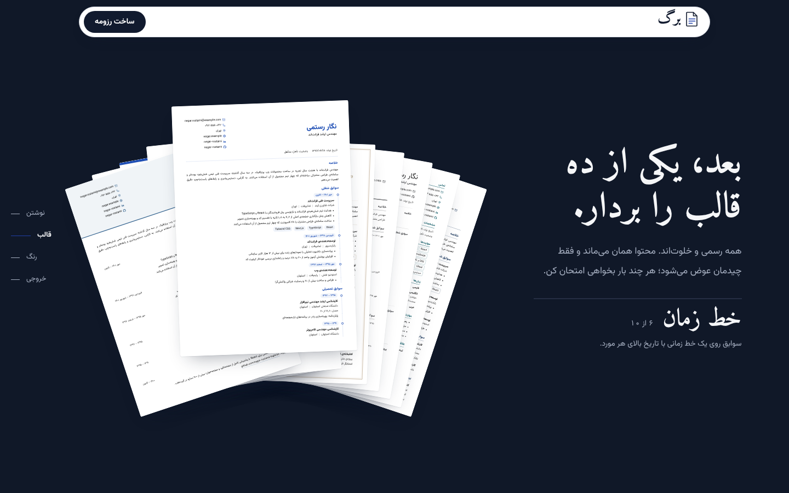
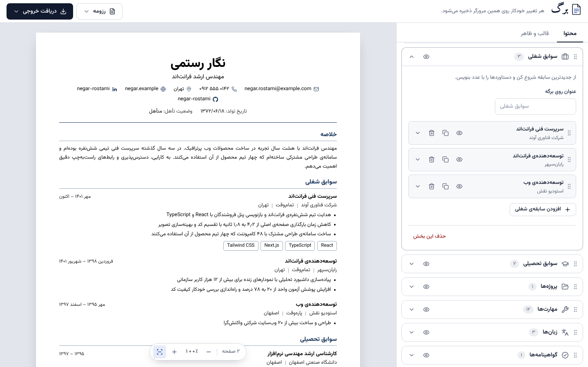
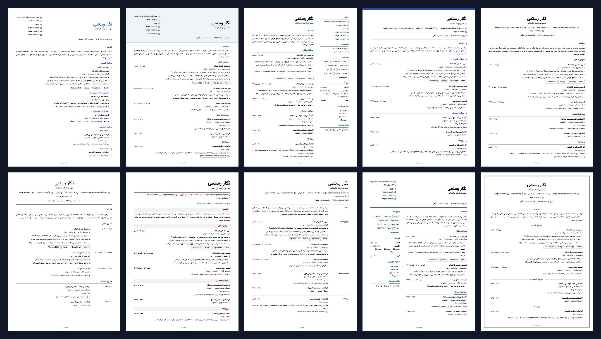

<div dir="rtl">

# برگ — رزومه‌ساز فارسی

رزومه‌ساز فارسی و راست‌به‌چپ که کاملاً در مرورگر اجرا می‌شود: ۲۲ بخش، ۱۰ قالب رسمی، ۶ رنگ‌بندی برای هر قالب، و خروجی PDF و Word. بدون ثبت‌نام و بدون سرور؛ اطلاعات کاربر فقط روی مرورگر خودش می‌ماند.



## چه دارد

- **صفحه‌ی نخست اسکرولی.** یک برگه‌ی A4 از اول تا آخر روی صحنه می‌ماند: نوشته می‌شود، مثل دستِ ورق به ده قالب باز می‌شود، رنگ عوض می‌کند و در آخر به دو فایل PDF و Word تبدیل می‌شود. برگه‌های این صحنه تصویر نیستند؛ همان کامپوننت واقعی رزومه‌اند.
- **ویرایشگر با پیش‌نمایش زنده.** هر تغییر همان لحظه روی برگه دیده می‌شود و خودکار در `localStorage` ذخیره می‌شود.
- **۲۲ بخش آماده** و هر تعداد بخش دلخواه: اطلاعات شخصی (با تاریخ تولد، تأهل و نظام وظیفه)، شبکه‌ها، خلاصه، سوابق شغلی، تحصیلات، مهارت‌ها، پروژه‌ها، زبان‌ها (با چهار مهارت CEFR)، گواهینامه‌ها، دوره‌ها، مهارت‌های نرم، افتخارات، مقالات، سوابق پژوهشی، تدریس، سخنرانی‌ها، اختراعات، فعالیت داوطلبانه، عضویت‌ها، علاقه‌مندی‌ها، معرف‌ها و اطلاعات تکمیلی.
- **۱۰ قالب × ۶ رنگ.** زمینه‌ی برگه همیشه سفید و متن سیاه است؛ رنگ فقط روی تیترها و خط‌ها می‌نشیند.
- **صفحه‌بندی خودکار روی A4.** محتوا بین برگه‌ها پخش می‌شود و تیتر هیچ بخشی از متنش جدا نمی‌افتد.
- **خروجی‌ها:** PDF با متن قابل انتخاب (از راه چاپ مرورگر)، PDF تصویری با دانلود مستقیم، Word (‎`.docx`‎) قابل ویرایش، و فایل پشتیبان JSON.
- **تاریخ شمسی و میلادی**، ارقام فارسی یا لاتین، و حالت رزومه‌ی انگلیسی (چپ‌به‌راست).
- جابه‌جایی بخش‌ها و موردها با کشیدن، با ماوس، لمس و صفحه‌کلید.
- چهار قلم برای برگه: وزیرمتن، نوتو سنس، نوتو نسخ و مرکزی.





## فناوری‌ها

| بخش | ابزار |
| --- | --- |
| رابط کاربری | React 19، TypeScript، Vite |
| سبک‌دهی | Tailwind CSS 4 برای رابط؛ CSS ساده با واحد میلی‌متر برای برگه‌ها |
| وضعیت | Zustand با `persist` |
| پویانمایی اسکرول | Motion (‎`useScroll` و `useTransform`‎) |
| مرتب‌سازی | dnd-kit |
| خروجی Word | docx |
| خروجی PDF تصویری | html2canvas-pro و jsPDF |
| مسیریابی | React Router (هش‌محور، مناسب میزبان ایستا) |

## اجرا

به Node.js نسخه‌ی ۲۰ یا بالاتر نیاز است.

```bash
npm install
npm run dev        # http://localhost:5173
npm run build      # بررسی نوع‌ها و ساخت نسخه‌ی نهایی در dist
npm run preview    # دیدن نسخه‌ی ساخته‌شده
```

## ساختار پروژه

```text
src/
  resume/            موتور رزومه (مستقل از رابط ویرایشگر)
    types.ts           مدل داده
    sections.ts        تعریف ۲۱ نوع بخش و فیلدهایشان
    templates.ts       ده قالب، پالت رنگ‌ها و قلم‌ها
    document.tsx       تبدیل رزومه به «بلوک»های قابل صفحه‌بندی
    ResumePages.tsx    اندازه‌گیری بلوک‌ها و چیدن روی برگه‌های A4
    resume.css         سبک قالب‌ها و قواعد چاپ
    i18n.ts            برچسب‌های روی برگه و نام ماه‌ها
    sample.ts          رزومه‌ی نمونه
  export/            خروجی PDF، Word و JSON
  store/             وضعیت برنامه و اعتبارسنجی داده‌ی ورودی
  pages/intro/       صفحه‌ی نخست و صحنه‌ی اسکرولی
  pages/builder/     ویرایشگر، پنل ظاهر، پیش‌نمایش و منوی خروجی
  components/        اجزای مشترک رابط
```

## چند نکته‌ی فنی

**صفحه‌بندی.** رزومه به بلوک‌های کوچک شکسته می‌شود (تیتر بخش، سرِ هر مورد، هر خط توضیح). یک نسخه‌ی پنهان از کل محتوا بیرون از صفحه رسم می‌شود تا ارتفاع بلوک‌ها بدون اثر `transform` اندازه‌گیری شود؛ بعد بلوک‌ها به ترتیب روی برگه‌های ۲۱۰ × ۲۹۷ میلی‌متری چیده می‌شوند. بلوک‌هایی مثل تیتر، علامت «با بعدی بمان» دارند. در قالب‌های دوستونه هر ستون جدا صفحه‌بندی می‌شود.

**قالب‌ها.** هر ده قالب از یک ساختار HTML استفاده می‌کنند و تفاوتشان در CSS و چند تنظیم (چیدمان، نوع سربرگ، شکل موردها) است. رنگ هر قالب با چهار متغیر CSS کنترل می‌شود.

**PDF.** گزینه‌ی اول از چاپ مرورگر استفاده می‌کند (‎`@page` با اندازه‌ی A4 و حاشیه‌ی صفر) و متن واقعی می‌دهد. گزینه‌ی دوم هر برگه را عکس می‌کند؛ ظاهرش عیناً همان پیش‌نمایش است ولی متنش قابل انتخاب نیست.

**Word.** چیدمان هر قالب با پاراگراف و جدول بی‌خط بازسازی می‌شود. تکه‌های لاتینِ داخل متن فارسی در runهای جدا نوشته می‌شوند تا ترتیبشان به‌هم نریزد. قلم وزیرمتن داخل فایل جاسازی می‌شود؛ سه قلم دیگر فقط به نام ذکر می‌شوند و اگر روی سیستم نصب نباشند Word قلم جایگزین می‌گذارد. خروجی Word به قالب نزدیک است، نه یکسان با آن.

## محدودیت‌ها

- داده‌ها فقط در `localStorage` همان مرورگر است؛ برای جابه‌جایی بین دستگاه‌ها باید فایل پشتیبان گرفت.
- در هر مرورگر یک رزومه نگه داشته می‌شود.
- موردی که از یک برگه‌ی کامل بلندتر باشد شکسته نمی‌شود.

## قلم‌ها

وزیرمتن، نوتو سنس عربی، نوتو نسخ عربی، مرکزی و امیری همگی با مجوز SIL Open Font License منتشر شده‌اند و از بسته‌های npm بارگذاری می‌شوند.

</div>

---

## English

**Barg** is a Persian, right-to-left résumé builder that runs entirely in the browser.

- Scroll-driven landing page built from the real résumé components (no images)
- Live editor with 22 sections plus unlimited custom ones
- 10 formal templates, 6 colour schemes each; the sheet stays white and the text black
- Automatic A4 pagination
- Export to text-based PDF (browser print), image PDF, editable Word (`.docx`) and JSON
- Jalali and Gregorian dates, Persian or Latin digits, optional left-to-right English mode
- No sign-up and no server; data stays in `localStorage`

Stack: React 19, TypeScript, Vite, Tailwind CSS 4, Zustand, Motion, dnd-kit, docx, html2canvas-pro, jsPDF.

```bash
npm install
npm run dev
```
